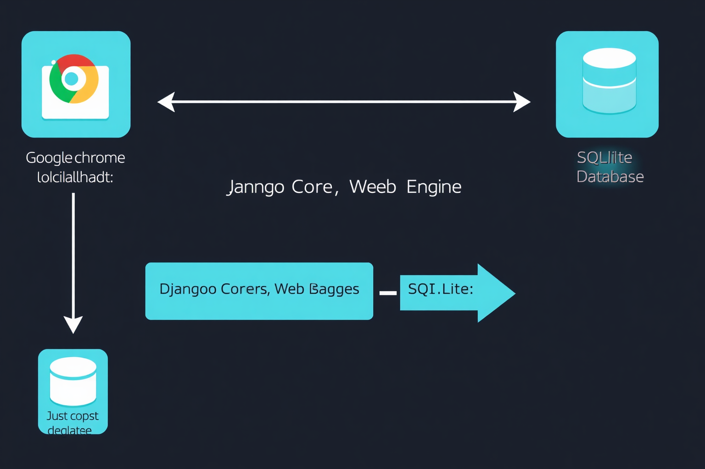

## Django POS & Inventory System — Ipo-Ipo POS
### Full Functional & Architectural Documentation

> ⚡ **Offline-First Desktop App** — Designed to run on localhost via `python manage.py runserver`, used through Chrome's "Save as Desktop App" feature (no internet required after install). No user login/authentication needed — boots straight into the POS screen.

### Architecture Overview



```
+---------------------------------------------------------------+
|                    LOCAL MACHINE TERMINAL                      |
|                                                                |
|  +--[Google Chrome -> Save as Desktop App]---+                 |
|  |  App Mode (No address bar, Windowed)       |                 |
|  +---------------------+----------------------+                 |
|                        |                                       |
|                localhost:8000                                   |
|                        v                                       |
|  +---------------------+----------------------+                 |
|  |         Django Core Web Engine              |                |
|  |  [URLs] -> [Views] -> [Forms] -> [Signals] |                |
|  +---------------------+----------------------+                 |
|                        |                                       |
|                  ORM (SQLite WAL)                               |
|  +---------------------+----------------------+                 |
|  |  SQLite Database (Easy backup — just copy) |                |
|  +--------------------------------------------+                 |
+---------------------------------------------------------------+
```

#### Application Runtime Stack
- **Core Frame:** Django Monolith (Python 3.11+) — offline-first transactional app.
- **Database:** SQLite with **Write-Ahead Logging (WAL)** mode for parallel reads + safe transaction isolation.
- **Client:** Google Chrome "Save as Desktop App" — full-screen kiosk-like experience, no address bar, no chrome elements.
- **UI Layer:** Server-side Django HTML Templates with lightweight utility CSS. No heavy frontend framework. Zero external API dependencies — works completely offline.
- **Backup:** Simply copy the `db.sqlite3` file — all your data in one portable file.

### 1. How to Deploy as a Desktop App

1. **Run the server:**
   ```bash
   cd /path/to/ipoipo-pos
   source venv/bin/activate
   python manage.py runserver 0.0.0.0:8000
   ```
2. **Open in Chrome** and navigate to `http://localhost:8000`
3. **Save as desktop app:**
   - Click the three-dot menu (⋮) → **Save and Share** → **Install page as app...**
   - Or: ⋮ → **Cast, save, and share** → **Install page as app...**
   - Name it "Ipo-Ipo POS"
   - Chrome creates a standalone desktop shortcut — opens windowed, no address bar
4. **Done.** No login screen. No internet. Opens straight to POS.

### 2. Database Schema

SQLite with WAL mode. Backup: just copy `db.sqlite3`.

```python
from django.db import models
from decimal import Decimal

class Category(models.Model):
    name = models.CharField(max_length=100, unique=True)
    description = models.TextField(blank=True, null=True)
    # Products get their emoji/image from the Item, not Category

    def __str__(self):
        return self.name

class Item(models.Model):
    category = models.ForeignKey(Category, on_delete=models.PROTECT, related_name='items')
    name = models.CharField(max_length=150, unique=True)
    sku = models.CharField(max_length=50, unique=True, verbose_name="SKU/Barcode")
    emoji = models.CharField(max_length=10, blank=True, null=True,
                             help_text="Emoji for visual display (e.g., 🍗🍚🥤)")
    image = models.ImageField(upload_to='product_images/', blank=True, null=True,
                               help_text="Product image (optional, emoji used as fallback)")
    cost_price = models.DecimalField(max_digits=10, decimal_places=2)
    selling_price = models.DecimalField(max_digits=10, decimal_places=2)
    stock_qty = models.IntegerField(default=0)
    low_stock_threshold = models.IntegerField(default=10)
    is_active = models.BooleanField(default=True)

    def display_icon(self):
        """Returns emoji if set, otherwise a generic icon."""
        return self.emoji or "📦"

    def __str__(self):
        return f"{self.display_icon()} {self.name} ({self.sku})"

class DiscountType(models.Model):
    DISCOUNT_CHOICES = [
        ('PERCENTAGE', 'Percentage Based'),
        ('FIXED', 'Fixed Cash Value'),
        ('PH_SPECIAL', 'Philippine Statutory (Senior/PWD)'),
    ]
    name = models.CharField(max_length=100, unique=True)
    kind = models.CharField(max_length=20, choices=DISCOUNT_CHOICES, default='PERCENTAGE')
    value = models.DecimalField(max_digits=10, decimal_places=2,
                                help_text="Percentage value or exact cash deduction amount.")
    is_active = models.BooleanField(default=True)

    def __str__(self):
        return f"{self.name} - {self.get_kind_display()}"

class Transaction(models.Model):
    PAYMENT_METHODS = [
        ('CASH', 'Cash'),
        ('DIGITAL', 'Digital Wallet (GCash/Maya)'),
    ]
    timestamp = models.DateTimeField(auto_now_add=True)
    subtotal = models.DecimalField(max_digits=10, decimal_places=2, default=0.00)
    discount_applied = models.ForeignKey(DiscountType, on_delete=models.PROTECT, null=True, blank=True)
    discount_amount = models.DecimalField(max_digits=10, decimal_places=2, default=0.00)
    vat_exclusive_sales = models.DecimalField(max_digits=10, decimal_places=2, default=0.00)
    vat_amount = models.DecimalField(max_digits=10, decimal_places=2, default=0.00)
    grand_total = models.DecimalField(max_digits=10, decimal_places=2, default=0.00)
    payment_method = models.CharField(max_digits=10, choices=PAYMENT_METHODS, default='CASH')
    reference_number = models.CharField(max_length=100, blank=True, null=True,
                                         help_text="Trace ID for GCash/Maya validation")
    total_diners = models.PositiveIntegerField(default=1)
    special_cardholders_count = models.PositiveIntegerField(default=0)

    def __str__(self):
        return f"TXN-{self.id} | {self.timestamp.strftime('%Y-%m-%d %H:%M')}"

class TransactionItem(models.Model):
    transaction = models.ForeignKey(Transaction, on_delete=models.CASCADE, related_name='line_items')
    item = models.ForeignKey(Item, on_delete=models.PROTECT)
    quantity = models.PositiveIntegerField()
    unit_price = models.DecimalField(max_digits=10, decimal_places=2)
    total_price = models.DecimalField(max_digits=10, decimal_places=2)

    def save(self, *args, **kwargs):
        self.total_price = self.unit_price * self.quantity
        super().save(*args, **kwargs)
```

**Key changes:**
- ❌ No `User` / `LoginRequiredMixin` — no authentication
- ✅ `emoji` field on Item for visual product display
- ✅ `image` field for product photos (emoji fallback)
- ✅ SQLite — just copy the file for backup
- ✅ No cashier ForeignKey — no login required

### 3. Business Logic: Checkout Engine & Discounts

```python
from decimal import Decimal, ROUND_HALF_UP
from django.db import transaction as db_transaction
from .models import Item, Transaction, TransactionItem

class CheckoutEngine:
    def __init__(self, cart_data, discount_id=None, payment_method='CASH',
                 ref_num=None, total_diners=1, special_count=0):
        """
        cart_data format: [{'item_id': 1, 'qty': 2}, {'item_id': 2, 'qty': 1}]
        No cashier parameter — the system works without login.
        """
        self.cart_data = cart_data
        self.discount_id = discount_id
        self.payment_method = payment_method
        self.ref_num = ref_num
        self.total_diners = total_diners
        self.special_count = special_count

        self.subtotal = Decimal('0.00')
        self.discount_amount = Decimal('0.00')
        self.vat_exempt_sales = Decimal('0.00')
        self.vat_amount = Decimal('0.00')
        self.grand_total = Decimal('0.00')

    def calculate_totals(self, discount_obj):
        for entry in self.cart_data:
            item = Item.objects.get(id=entry['item_id'])
            self.subtotal += item.selling_price * Decimal(entry['qty'])

        if discount_obj and discount_obj.is_active:
            if discount_obj.kind == 'PERCENTAGE':
                self.discount_amount = (self.subtotal * (discount_obj.value / Decimal('100.00'))).quantize(
                    Decimal('0.01'), rounding=ROUND_HALF_UP)
                vtable_balance = self.subtotal - self.discount_amount
                self.vat_exclusive_sales = (vtable_balance / Decimal('1.12')).quantize(
                    Decimal('0.01'), rounding=ROUND_HALF_UP)
                self.vat_amount = vtable_balance - self.vat_exclusive_sales
                self.grand_total = vtable_balance

            elif discount_obj.kind == 'FIXED':
                self.discount_amount = discount_obj.value
                vtable_balance = max(Decimal('0.00'), self.subtotal - self.discount_amount)
                self.vat_exclusive_sales = (vtable_balance / Decimal('1.12')).quantize(
                    Decimal('0.01'), rounding=ROUND_HALF_UP)
                self.vat_amount = vtable_balance - self.vat_exclusive_sales
                self.grand_total = vtable_balance

            elif discount_obj.kind == 'PH_SPECIAL':
                # PH Senior/PWD statutory discount formula
                gross_share = (self.subtotal / Decimal(self.total_diners)) * Decimal(self.special_count)
                vat_component_in_share = (gross_share - (gross_share / Decimal('1.12'))).quantize(
                    Decimal('0.01'), rounding=ROUND_HALF_UP)
                exempt_base = (gross_share / Decimal('1.12')).quantize(
                    Decimal('0.01'), rounding=ROUND_HALF_UP)
                law_discount = (exempt_base * Decimal('0.20')).quantize(
                    Decimal('0.01'), rounding=ROUND_HALF_UP)

                self.discount_amount = law_discount
                self.grand_total = (self.subtotal - vat_component_in_share - law_discount).quantize(
                    Decimal('0.01'), rounding=ROUND_HALF_UP)
                self.vat_exclusive_sales = (self.grand_total / Decimal('1.12')).quantize(
                    Decimal('0.01'), rounding=ROUND_HALF_UP)
                self.vat_amount = self.grand_total - self.vat_exclusive_sales
        else:
            self.vat_exclusive_sales = (self.subtotal / Decimal('1.12')).quantize(
                Decimal('0.01'), rounding=ROUND_HALF_UP)
            self.vat_amount = self.subtotal - self.vat_exclusive_sales
            self.grand_total = self.subtotal

    def process(self):
        from .models import DiscountType
        discount_obj = DiscountType.objects.get(id=self.discount_id) if self.discount_id else None

        with db_transaction.atomic():
            self.calculate_totals(discount_obj)

            txn = Transaction.objects.create(
                subtotal=self.subtotal,
                discount_applied=discount_obj,
                discount_amount=self.discount_amount,
                vat_exclusive_sales=self.vat_exclusive_sales,
                vat_amount=self.vat_amount,
                grand_total=self.grand_total,
                payment_method=self.payment_method,
                reference_number=self.ref_num,
                total_diners=self.total_diners,
                special_cardholders_count=self.special_count
            )

            for entry in self.cart_data:
                item = Item.objects.select_for_update().get(id=entry['item_id'])
                if item.stock_qty < entry['qty']:
                    raise ValueError(f"Insufficient stock for product: {item.name}")

                TransactionItem.objects.create(
                    transaction=txn,
                    item=item,
                    quantity=entry['qty'],
                    unit_price=item.selling_price
                )
                item.stock_qty -= entry['qty']
                item.save()

            return txn
```

**Key changes:**
- ❌ Removed `cashier` parameter — no user/authentication model needed
- ✅ Transaction model updated: no `cashier` ForeignKey field

### 4. Inventory Views (No Login Required)

```python
from django.shortcuts import render, redirect, get_object_or_404
from django.views.generic import ListView, CreateView, UpdateView
from django.urls import reverse_lazy
from .models import Item

class InventoryDashboardView(ListView):
    model = Item
    template_name = 'inventory/dashboard.html'
    context_object_name = 'inventory_items'

    def get_queryset(self):
        return Item.objects.filter(is_active=True).order_by('name')

class ItemCreateView(CreateView):
    model = Item
    fields = ['category', 'name', 'sku', 'emoji', 'image', 'cost_price',
              'selling_price', 'stock_qty', 'low_stock_threshold']
    template_name = 'inventory/item_form.html'
    success_url = reverse_lazy('inventory_dashboard')

class ItemUpdateView(UpdateView):
    model = Item
    fields = ['category', 'name', 'sku', 'emoji', 'image', 'cost_price',
              'selling_price', 'stock_qty', 'low_stock_threshold', 'is_active']
    template_name = 'inventory/item_form.html'
    success_url = reverse_lazy('inventory_dashboard')
```

**Key changes:**
- ❌ Removed all `LoginRequiredMixin` — no authentication
- ✅ Added `emoji` and `image` fields to forms

### 5. POS Checkout API

```python
import json
from django.http import JsonResponse
from django.views.decorators.csrf import csrf_exempt
from .services import CheckoutEngine

@csrf_exempt
def checkout_submit_api(request):
    if request.method == 'POST':
        try:
            payload = json.loads(request.body)
            cart = payload.get('cart', [])
            discount_id = payload.get('discount_id', None)
            pay_method = payload.get('payment_method', 'CASH')
            ref_num = payload.get('reference_number', None)
            diners = int(payload.get('total_diners', 1))
            specials = int(payload.get('special_count', 0))

            if not cart:
                return JsonResponse({'status': 'error', 'message': 'Cart empty'}, status=400)

            engine = CheckoutEngine(
                cart_data=cart,
                discount_id=discount_id,
                payment_method=pay_method,
                ref_num=ref_num,
                total_diners=diners,
                special_count=specials
            )

            executed_txn = engine.process()
            return JsonResponse({
                'status': 'success',
                'transaction_id': executed_txn.id,
                'grand_total': str(executed_txn.grand_total)
            })

        except ValueError as val_err:
            return JsonResponse({'status': 'error', 'message': str(val_err)}, status=400)
        except Exception:
            return JsonResponse({'status': 'error', 'message': 'Processing fault'}, status=500)

    return JsonResponse({'status': 'error', 'message': 'Invalid method'}, status=405)
```

**Key changes:**
- ❌ Removed `@login_required` — no authentication
- ❌ Removed `cashier` parameter — no user model
- ✅ Open API — any staff can use it

### 6. POS Screen Template — Product Grid with Emoji/Image

The POS layout uses a 60/40 split: product grid on the left, checkout panel on the right. Each product card shows its emoji (or image) prominently for quick visual scanning — essential for fast-paced counter service.

```html
<!-- Product card — each item has emoji or image -->
<div class="product-card" onclick="addToCart({{ item.id }}, '{{ item.name }}', {{ item.selling_price }})">
    <div class="product-icon">{{ item.display_icon }}</div>
    
        
    
    <h4>{{ item.name }}</h4>
    <p class="price">₱{{ item.selling_price|floatformat:2 }}</p>
    <small>Stock: {{ item.stock_qty }}</small>
</div>
```

### 7. Verification & Test Script

```bash
python manage.py shell
```

```python
from pos_app.models import Item, Category, DiscountType
from pos_app.services import CheckoutEngine

# Sample data
cat = Category.objects.create(name="Express Bulk Meals")
chicken = Item.objects.create(
    category=cat, name="8pc Chicken Meal Bundle", sku="CPM-08",
    emoji="🍗", cost_price=400.00, selling_price=650.00, stock_qty=50
)

# Add PH Senior/PWD discount
ph_law = DiscountType.objects.create(
    name="Senior / PWD", kind="PH_SPECIAL", value=20.00
)

# Test: 4 diners, 1 SC cardholder, 1 chicken bucket
engine = CheckoutEngine(
    cart_data=[{'item_id': chicken.id, 'qty': 1}],
    discount_id=ph_law.id,
    total_diners=4, special_count=1
)
txn = engine.process()

print(f"Subtotal: ₱{txn.subtotal}")
print(f"Discount: ₱{txn.discount_amount}")
print(f"Grand Total: ₱{txn.grand_total}")
# → ₱650.00 subtotal, ~₱30.86 discount, ~₱584.82 grand total
```

### Data Flow Summary

```
1. User opens Chrome Desktop App → localhost:8000
2. Sees product grid with emoji/images, no login prompt
3. Taps products to build cart
4. Applies discount (optional)
5. Hits Checkout → POST /pos/api/checkout/
6. CheckoutEngine validates stock, calculates VAT & discounts
7. Transaction + line items saved to SQLite
8. Stock deducted
9. Receipt displayed

Backup? Just copy db.sqlite3 — done.
```
